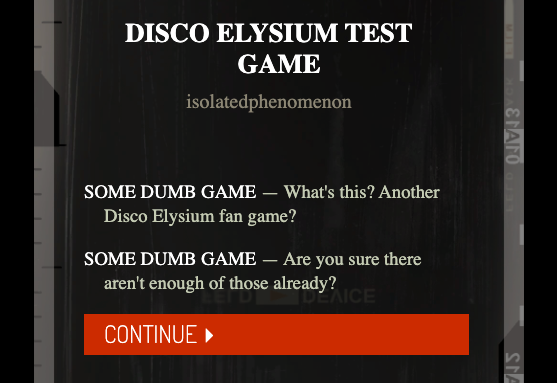
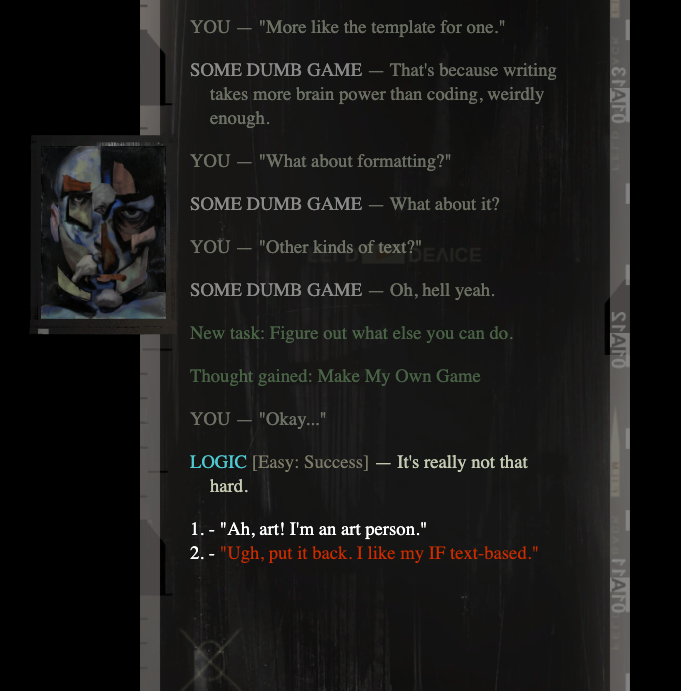
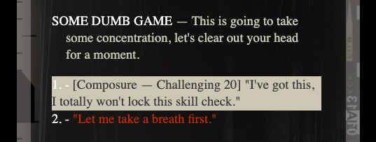
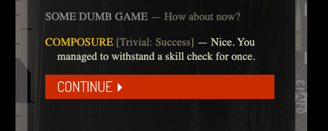

# Disco Elysium Inkjs Template

A Disco Elysium-themed template for Inkle's Inkjs port. You can access a working version of the template at INSERT LINK HERE.

## Description
This repository is a proof-of-concept webpage game styled after Disco Elysium and written in Ink. It is intended as a template for others to use to create their own fan games in Ink.

The style mimics the dialogue text display of the original game and includes anything that can be found there - defined speakers, paragraph description, choices, previously-visited choices, tasks/XP/thoughts, red checks, white checks, locked white checks, and continue/end buttons. It also includes the ability to display speaker images alongside the text.

The style and scripting changes have been made to lower the amount of formatting needed in Ink, so while there is custom syntax described below, its intention is to be minimally intrusive so game makers can focus on writing. You can use this template without knowing anything about Javascript, HTML, or CSS - the styling is all handled in Ink, which is a relatively easy-to-learn language designed for non-linear interactive fiction and well supported by a thriving community of writers.

## Screenshots

## Setup
### New Game
The easiest method to set up your own instance is to copy the "discoelysiumgame" folder, then edit `discoelysiumgamge.ink` accordingly.

From there, you can select File -> Export story.js only when satisfied with your Ink code and replace `discoelysiumgame.js` with the file produced by Ink's compiler. If you export for web instead, you will overwrite the template.

### Existing Game
If you have a pre-existing game you wish to style using this template, simply replace `main.js`, `index.html`, and `style.css` with the files from this repository. You may choose to include the images folder or a subset thereof as well.

## Syntax
The following descriptions are outlined again in `discoelysiumgame.ink`, with examples provided in the template.

### General
  - #CLEAR clears the scroll, as per Ink norm, best used after a continue.
  - "Skill" here as a variable for a tag (e.g. #SPEAKER or #PORTRAIT) means the first three letters of the skill in lowercase (e.g. ele for electrochemistry, esp for esprit de corps)

### Choices
  - <you> should be used before all "you" choices to force the appropriate style, except for skill checks.
  - ▸ as a choice will provide a caps-locked continue popup.
  - ■ as a choice will provide a caps-locked end popup.
  - <read> in a choice will dim the choice; best used logically

### Speakers
  - <name><end> will provide a caps-locked white name.
  - <int><end>, <psy><end>, <fys><end>, and <mot><end> will provide a caps-locked skill of the appropriate color.
  - #SPEAKER: speaker will provide a caps-locked white name and hyphen, and #SPEAKER: skill will provide a caps-locked skill of the appropriate color
  - (Either of the above works for both. I decided to keep them in case people wanted to customize skills here, like PERCEPTION (HEARING) for example; if you want completely new skills and want use of the tags, edit main.js.)

### Checks
  - <red>, <white>, or <locked> in a choice will provide the appropriate style; locked is best used logically and will override white if both are present.
  - (Since the game doesn't have different styling for the skills listed at the start of checks, you'll have to do that manually here! Include \[ and\] around your skill, which for a white skill, will be replaced with "Locked" if locked.)
  - <check><end> will provide the correct color for post-skill name checks in the story text.
  - #CHECK: difficulty-success will provide a check after the speaker for a given difficulty and success status. As with skills, use first three letters (e.g.: tri-suc for "Trivial: Success.")
  - (Either of the above works. The first in combination with the first speaker method is good for when you want to have a one-off funny check (e.g. "Beyond Trivial - Epic Failure"), but note that #CHECK will only work if you use it before a #SPEAKER)

### Tasks  
  - <task><end> will provide the correct color for tasks, thoughts, items, and XP.
  - #CLASS: task will do the same thing
  - (Use the first if you want only part of a paragraph to be formatted accordingly.)

### Portraits
  - #PORTRAIT: skill will prompt a portrait of the appropriate skill. "kim" and "harry" are also built-in portraits.
  - Note that this is only possible at the end of text, NOT choices. Portraits will be cleared after a choice is made. More portraits (such as those of players) can be added; see main.js for instructions or to change the shorthand for skills.

## Customization
### Simple Customization
In-text formatting (excluding choices/checks) has both an Ink tag version and a custom markup version. These markup versions (e.g. <int>Wisdom<end> to provide the styling of an intelligence speaker) are intended for one-off usage or for coders proficient in Ink who don't want to interact with javascript.

### Add Speaker Portraits
  - To add more speaker portraits, upload an image of the speaker to the images folder
  - In `main.js`, edit the object `portraits` to include the shorthand and file name, e.g. "jean": "jean.png"
  
### Custom Skills/Speakers
  - In `main.js`, edit one of the objects `int`, `psy`, `fys`, or `mot` to modify or add custom skills with intellect, psyche, physique, or motorics styling
  - Follow the above to edit speaker portrait images if desired
  - To add a completely new attribute or speaker styling, define another object with the same structure and append it to `skills` in `main.js`
  - Create a new CSS class with the same name as the object and style how you choose.

### Check Failure/Success, Thoughts, Other Pop-ups
I did not include any other graphics that don't appear directly in-line on the text display in the original game as a matter of personal preference. This includes the flashes for check failures/successes, dice rolls, thoughts completing, etc. 

If you wanted to fiddle with this, a good place to find an example would be lines 266-290 in `main.js`. Here I've defined my own fake html markers that don't get displayed but will be passed along by the Ink compiler. Doing the same, and then running some function to display an image etc. would be a good way to trigger things conditionally. (Ink tags may also be useful, but they can't be changed like variables within ink and cannot be toggled true/false, so depending on how dependent on variables/choices/etc. your game is, they might not cut it.)

## Future Additions
As of right now, this template (like many instances of interactive fiction) is not the friendliest to a screen reader. Images are currently basically described, and the screen is navigable with a keyboard, but reading will go from the start of the on-screen text instead of the most recent paragraph. This is something I plan to continue work on, though it'll require more research on my end. This is somewhat mitigated by clearing the screen often or after every

The scrollbar will also hopefully be styled to look more like the one in Disco Elysium at some point. To be honest, I worked on it for too long to no avail and decided it's a problem for future me who will hopefully know more CSS.

## Attribution
This template is of course based off of [Disco Elysium](https://discoelysium.com/) and uses [Inkle's Ink](https://www.inklestudios.com/ink/).
The [portraits](https://imgur.com/a/NTCGqdZ), [backgrounds](https://drive.google.com/drive/folders/12Tt0bJSNit37yg1rqhJKcRSiEuljzH3Y?usp=sharing), and [favicon](https://www.stickpng.com/img/icons-logos-emojis/tech-companies/disco-elysium-app-icon) come directly from the game, and the [fonts](https://www.reddit.com/r/DiscoElysium/comments/jlaubn/name_of_the_text_font_used_in_disco_elysium/) likewise are pulled from or inspired by the original game.

This would not exist without the other IF frameworks [made](https://github.com/apepers/DiscoElysiumTwineMacros) or [being made](https://haunthouse.tumblr.com/post/698460178938478592/hmmm-i-kinda-want-to-write-some-disco-elysium) for other platforms and languages, and a huge shoutout to everyone else making fan games!
